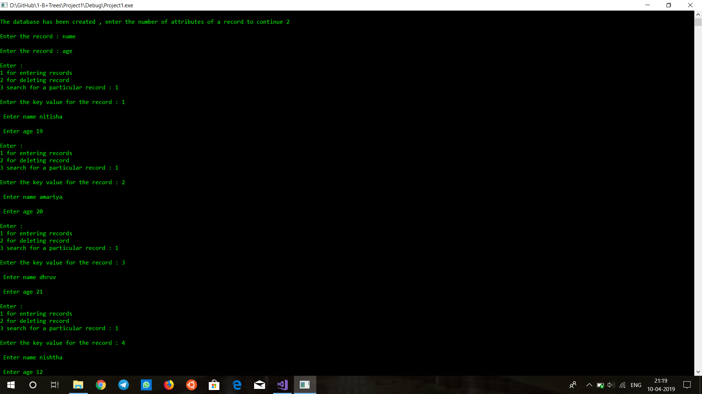
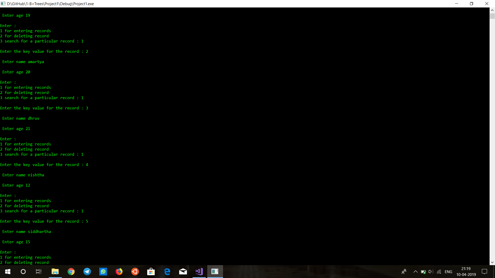
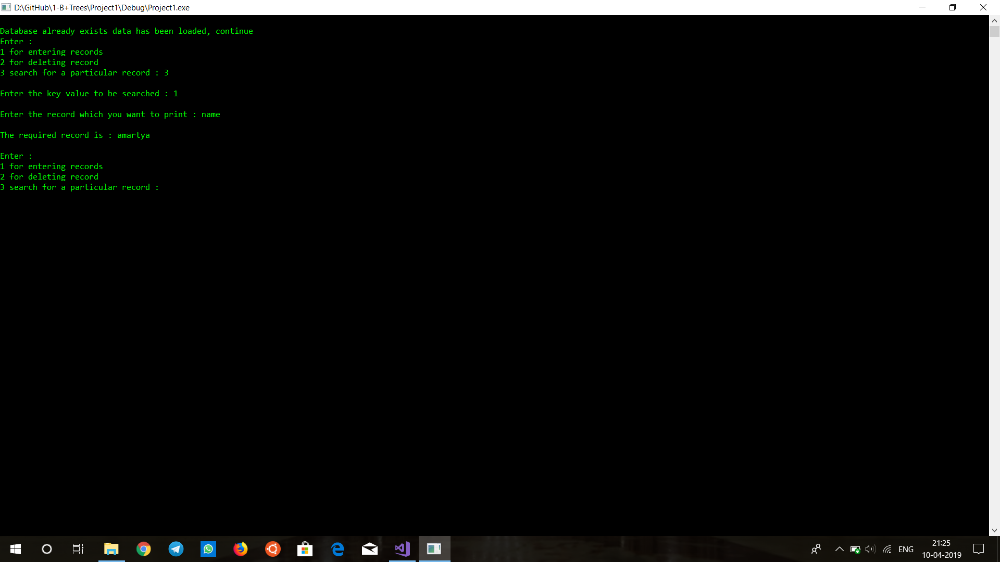

# Simulation of database indexing using B+ Trees

A B+ tree is an N-ary tree with a variable but often large number of children per node. A B+ tree consists of a root, internal nodes and leaves. The root may be either a leaf or a node with two or more children.

A B+ tree can be viewed as a B-tree in which each node contains only keys (not key–value pairs), and to which an additional level is added at the bottom with linked leaves.

The primary value of a B+ tree is in storing data for efficient retrieval in a block-oriented storage context — in particular, filesystems. This is primarily because unlike binary search trees, B+ trees have very high fan-out (number of pointers to child nodes in a node, typically on the order of 100 or more), which reduces the number of I/O operations required to find an element in the tree

In this project a demo for indexing using b+ trees is created where it creates the database at the first instance of running the program and then at the second instance loads the same state in which it was closed.

# Steps to run: 

1. Clone the repository
2. Run main.cpp

# Outputs: 

